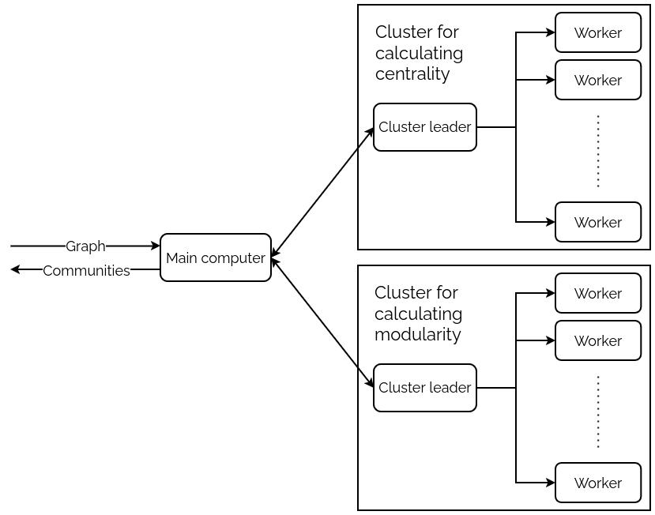

# Distributed Girvan-Newman algorithm for community detection

This repository contains code for paper I wrote during summer seminar at Petnica (2023). Poster for this paper can be seen [here](https://konferencija.petnica.rs/konferencija-2023/apstrakti-radova/racunarstvo/) and the paper itself can be read [here](https://ieee.elfak.ni.ac.rs/wp-content/uploads/2023/11/2023.pdf) (page 181). Poster and paper are only avalible in Serbian.

## Abstract 
This paper presents a distributed version of the Girvan-Newman algorithm for community detection. A community is a group of nodes in a graph such that the number of edges between nodes in that group is much larger than the number of edges between nodes in that group and other nodes. They are often found in real networks, and their detection can provide useful insights into the observed network. Girvan-Newman algorithm works by iteratively finding and deleting the most central edge (the edge with the highest centrality value). After each deletion, modularity of the graph is calculated, which represents a measure of the prominence of communities in the graph. Result of the algorithm is a graph for which the maximum modularity has been calculated. Disadvantage of this algorithm is that for graphs with thousands of nodes, execution requires a lot of time. The idea in this paper is to investigate whether it is possible to reduce the execution time if the algorithm is executed on multiple computers. The distributed version of the algorithm works by calculating centrality and modularity on different computers. Computers that calculate centrality form one cluster, while computers that calculate modularity form another cluster. Each computer in the corresponding cluster is assigned an interval of nodes over which it should perform the calculation. In addition to the mentioned clusters, there is also a main computer in the system whose task is to initialize the entire system, coordinate the clusters, and construct the result based on the values calculated by the computers in the clusters. System was tested with clusters containing 1, 2, and 5 computers. Obtained results show that the execution time of the algorithm decreases if the number of computers in the system increases, however, optimal size of the system size was not found, which is a topic for further research.

The system was tested on Google Cloud virutal machines. For coordination of the system ZooKeeper library was used. All important code is located on `master` branch. Branches `cluster2` and `cluster5` were used only for easier setup of virtual machines on the cloud.

Schematic of the system